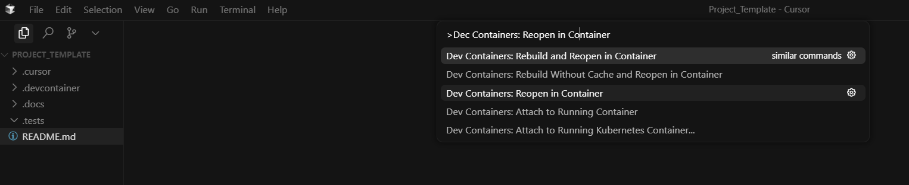

# Cursor Setup Template

## Requirements
- Cursor (or VSCode)
- Devcontainer extension
- Docker Desktop

## Usage
1. Copy this template to a new location and rename the folder to your desired project name.
2. Open the project folder in Cursor or VSCode.
3. Launch command palette and rebuild container to launch into dev container.

4. Fill out `.docs/Initial_Prompt.md` with your project requirements.
5. Follow the AI's instructions for project setup and development.

All template control files (`.docs/`, `.cursor/`, `.devcontainer/`, `.tests/`) should remain in the project root and be excluded from version control using `.gitignore`.

